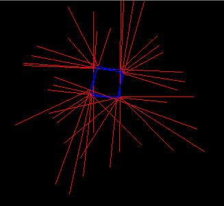
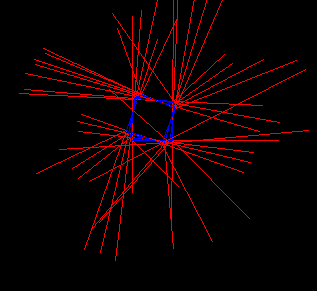

### Testausdokumentti
###### 14.1.2018

#### Testi 1

Testataan, kuinka hyvin robotti pysyy suunnassaan käännöksissä ja kuinka hyvin sensoridata pitää tämän jälkeen paikkansa. Teipattiin lattiaan 50x50 cm neliö ja kovakoodattiin robotti kulkemaan 50 cm eteenpäin ja kääntymään oikealle 90 astetta, tämän jälkeen olinpaikkansa tietokoneelle BT-yhteyden kautta ilmoittaen. Samalla karttaohjelma piirsi kuvaa.

Ensimmäisellä yrityksellä todettiin, että noin toisella kokonaisella kierroksella alkoi jokseenkin selvästi näkyä lievä oikealle viettäminen. Tämä näkyi myös visualisoinnissa:  
   
###### Kuvassa robotin reitti sinisellä ja anturin mittatulokset punaisella.
Huomataan, että robotin DifferentialPilot-luokalle annettavat mitat ovat hieman pielessä -- raideväli on jokseenkin tasan 12 senttimetriä, mutta koodi vaatii tuumakokoa ja pyöristystä oli ehkä liikaa.

Korjauksen jälkeen robotin muutaman asteen heitto alkoi näkyä vasta noin neljännellä kierroksella, ja tässäkin saattoi vaikuttaa hieman alusta ja ympäristö. Visualisoituna neliö piirtyi edelleen hieman vinoon:

Tämän jälkeen kokeiltiin lisätä koodiin virheenkorjaus -- robotti pitää kirjaa siitä, mihin suuntaan sen pitäisi suurinpiirtein osoittaa. Jokaisen käännöksen jälkeen pyydetään MCLPoseProviderilta arvio nykyisestä suuntimasta ja tehdään hienosäätöä sen perusteella. Kokeen perusteella neljä käännöstä ja korjausta menee hienosti, mutta sen jälkeen jossain sekoaa. Korjaus ei toki ottanut huomioon sitä, että seuraavaksi kuljetun matkan pitäisi myös muuttua hieman, mutta se ei selitä sekoamista.

#### Testi n+1

Koska nyt näyttää, että koodataan robottiin vain "jotain" ja unohdetaan koko höskä sen jälkeen, seuraavaa testattavaa ei nyt tähän hätään keksitä.
